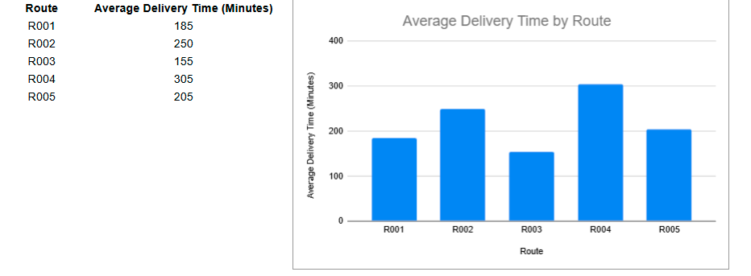
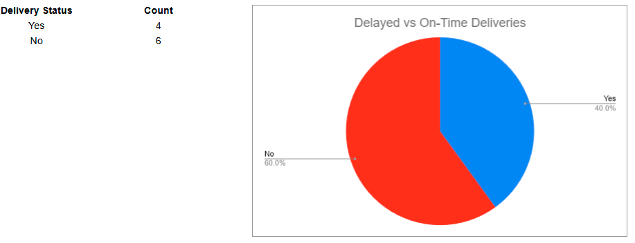

# 📊 Delivery Route Performance Analysis

## Objective
Analyze delivery route performance data to identify patterns in delays and provide recommendations for operational improvements.

---

## Background
This project is inspired by real-world operational workflows involving delivery routes and time-based performance metrics. The goal is to demonstrate foundational data analysis skills using realistic data.

---

## Data
The dataset includes:
- Route ID
- Delivery date
- Distance (miles)
- Delivery time (minutes)
- Delay indicator (Yes/No)

---

## Tools Used
- **SQL** (data querying and aggregation)
- **Google Sheets** (data cleaning, pivot tables, visualizations)

---

## Process
1. Cleaned the dataset by handling missing values and standardizing formats
2. Used SQL to aggregate delivery time and delay metrics by route and delivery status
3. Queried summarized data to identify trends in delivery time and delays
4. Created visualizations in Google Sheets to highlight key insights

---

## Key Insights
- Average delivery time varied by route 
- Some routes consistently showed longer delivery times
- Delays occurred more frequently on high-distance routes

Note: This analysis is based on simulated data and is intended for demonstration purposes.

---

## Recommendations
- Review high-delay routes for scheduling improvements  
- Balance route distances to reduce delays

---

## Visualizations

---

## What I Learned
- How to structure a simple data analysis project
- How to clean and validate operational data
- How to communicate insights clearly using visualizations

---

## Next Steps
- Expand analysis with additional variables
- Build an interactive dashboard
- Apply similar analysis to other operational datasets
